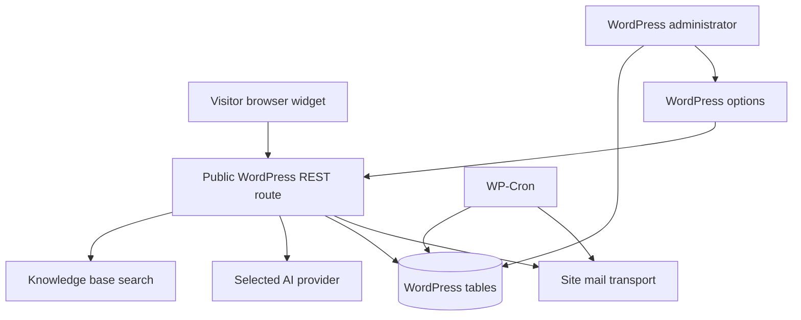

# System architecture

## Scope

SHU AI Assistant is a single WordPress plugin, installed on the Safety Host Unit site. WordPress hosts the widget, REST endpoint, administrator screens, tables, options, and scheduled jobs. The only required external runtime service is the configured model provider. Email uses the site's `wp_mail` transport. There is no separate Node server or vector database.



## Components and ownership

| Component | Main file(s) | Responsibility |
| --- | --- | --- |
| Bootstrap | `shu-ai-assistant.php` | Hooks, assets, settings defaults, schema upgrade and schedule repair |
| Visitor widget | `assets/js/chat-widget.js`, `assets/css/chat-widget.css` | UI, locale-sensitive greeting, client session token, recent history, accessible interaction |
| REST orchestrator | `includes/class-shu-rest-api.php` | Validation, rate limit, prompt construction, provider selection, capture handoff |
| Retrieval | `class-shu-knowledge-base.php`, `class-shu-relevance-engine.php` | Page/Post indexing, bounded candidate selection, lexical ranking |
| Providers | `class-shu-*-client.php`, provider interface | HTTPS requests, multiple keys, response normalization, cooldown |
| Lead operations | `class-shu-leads.php`, `class-shu-lead-fields.php`, `class-shu-lead-scoring.php` | Validation, deduplication, qualification, priority, notifications, manual reviews |
| Reporting | `class-shu-analytics.php`, `class-shu-weekly-digest.php`, `admin/` | Logs, session browser, exports, dashboards, digest |
| Storage/security | `class-shu-activator.php`, `class-shu-crypto.php` | Additive tables, cleanup schedule, provider-key encryption and migration |

## Request path

```mermaid
sequenceDiagram
    participant B as Browser
    participant W as WordPress REST
    participant D as WordPress DB
    participant A as AI provider
    B->>W: Message, session token, recent turns
    W->>D: Search indexed content and log visitor turn
    W->>A: System instructions, facts, context, turns
    A-->>W: Reply and optional confirmed lead marker
    W->>D: Validate/store lead if eligible; log assistant turn
    W-->>B: Clean reply and lead status
```

The model receives recent browser turns for conversational continuity. The database transcript is created from **server-logged turns**, so a client cannot replace an existing server record by editing its `history` field. The model's lead marker is treated as untrusted input: recent confirmation and required fields are checked server-side. This does not prove all AI-extracted facts are correct; a person still validates the inquiry.

## Trust boundaries

1. **Public/browser → WordPress:** all input is untrusted. The route is public, request size and per-IP rate are bounded, role values are restricted, and no visitor API key is exposed. Admin WordPress nonces are used only for privileged actions.
2. **WordPress → provider:** provider credentials are decrypted only on the server. Provider replies and errors never expose literal keys to visitors or server logs. Model output must not be treated as authoritative business data.
3. **Published content → prompt:** site excerpts are useful evidence, not instructions. Administrators control Key Facts; editors who can publish content can influence answers, so WordPress publishing permissions matter.
4. **Administrator → database/email:** `manage_options` gates viewing/export and changes; separate nonces gate mutations/downloads. Review email is manual and restricted to closed leads.

## Deployment and availability

A ZIP containing the `shu-ai-assistant/` folder is the deployable artifact. Activation or upgrade calls `dbDelta()` for additive schema changes. Published posts are indexed on save; after upgrade, an admin runs a full rebuild to backfill vectors. Model or mail failures fall back to office contact details or an admin-visible error; the widget is not an emergency channel. WP-Cron runs daily log cleanup and reschedules a Monday digest, but traffic or a server cron is needed to trigger due jobs.

The three providers are alternatives, not an automatic cross-provider fallback. Multiple keys fail over **within** the selected provider. WordPress's database and object cache are the operational state. Back up the database before upgrading; staging should test the active theme, caching/CDN, provider connectivity, mail delivery, and both office phone links.
