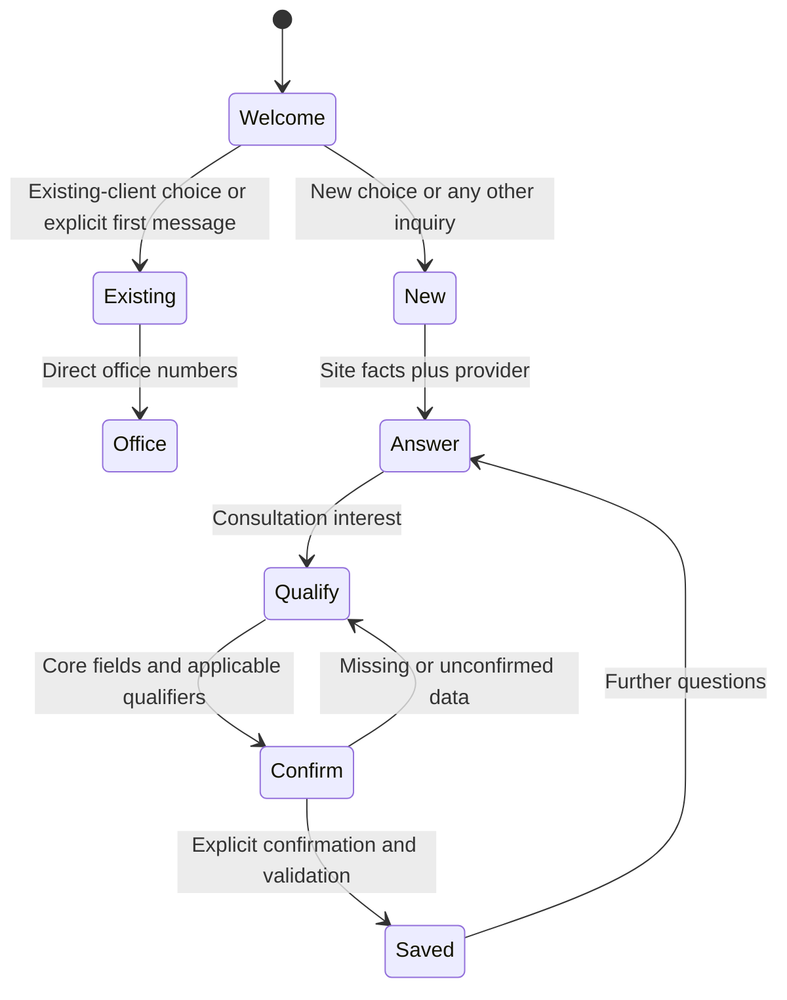

# System design

This document describes version 2.1.0 as implemented. It separates deterministic server checks from model-guided conversation behavior.

## Data model

Table names use the site's WordPress prefix, shown as `wp_` below.

| Table | Purpose | Important fields / indexes |
| --- | --- | --- |
| `wp_shu_chat_kb` | Searchable public content | `post_id`, `source_url`, `title`, `content_chunk`, `vector` (JSON term frequencies), `updated_at`; index `post_id` |
| `wp_shu_chat_log` | Server-observed conversation turns | `session_id` (HMAC hash), `role`, `message`, `kb_score_max`, `created_at`; indexes `session_id`, `created_at` |
| `wp_shu_chat_leads` | Confirmed consultation records | contact fields, `service`, `location`, `urgency`, JSON `extra_fields`, `priority`, JSON `conversation_transcript`, `session_id` (unique when present), `status`, `review_requested_at`, `created_at`; status/priority/date indexes |
| `wp_options` | Settings and schedule state | `shu_ai_options`, `shu_ai_db_version`, key rotation pointers, KB index metadata; keys stored as authenticated encrypted strings |

The v2.1 migration adds nullable `session_id` to existing leads and a unique index. Existing rows remain valid with `NULL` session IDs. Older chat-log rows keep their legacy session grouping and can still be browsed until retention cleanup. New sessions use a random 16-byte browser token, transformed into a 64-character HMAC using the installation's WordPress auth salt. The token itself is not stored in the database; reloading the page starts a new session. A missing/malformed token creates a new server session per request for older clients.

## Conversation state and capture



The six core fields are name, phone, email, service, location, and timing/urgency. A phone **or** email is required for database capture; the prompt asks for both. Service-specific `extra_fields` are limited to keys for the canonical service map. The model proposes a `[[SHU_LEAD_CAPTURE]]` marker followed by one JSON line. The REST layer strips that payload from the visitor reply and saves only when the current user message confirms a prior assistant confirmation question and required fields pass validation. The database's unique session index suppresses repeated lead creation and duplicate emails in one session. Conversational extraction is probabilistic; no automatic sales or scheduling action follows a saved lead.

Priority is computed on the server at save time: configured high-value services or dates within seven days are Hot; cold wording such as “not urgent” is checked before generic hot terms; other urgent wording is Hot; the remainder is Warm. Only unambiguous ISO `YYYY-MM-DD` dates get calendar parsing. The scoring rules are editable in Leads & Scoring and are saved independently of general settings.

## Public endpoint

`POST /wp-json/shu-chat/v1/message`

```json
{
  "message": "We need security for a private event",
  "history": [{"role": "assistant", "content": "What date is the event?"}],
  "session_id": "32-lowercase-hex-characters",
  "session_type": "new",
  "lang": "en-US"
}
```

The route accepts guest traffic. The `message` is limited to 4,000 bytes server-side and recent history to 12 turns, with each turn bounded to 4,000 bytes and `role` limited to `user` or `assistant`. The shipped widget input is 2,000 characters. The REST response contains `reply` and, when capture was attempted, a small `lead` result; provider/rate-limit failures return a safe office-contact reply. The public route intentionally does not use a guest WordPress nonce because a cached page could serve an expired one and a guest nonce does not authorize a visitor. Per-IP throttling uses `REMOTE_ADDR` rather than spoofable forwarded headers; sites behind a proxy should ensure the web server sets a meaningful address.

## Retrieval and provider selection

On save, published Page/Post text is stripped of markup/shortcodes, split into sentence chunks, and represented as normalized term-frequency JSON. At query time, synonyms expand the keyword list; SQL returns up to 200 literal matches plus 300 recent chunks, deduplicated by ID. A blend of cosine and keyword score ranks these candidates, and very-low-score matches are omitted. This is **lexical similarity**, not embeddings, semantic comprehension, or corpus-level TF-IDF; content beyond the bounded candidate set can be missed. Manual rebuild pages through source posts 100 at a time and truncates/repopulates the index, so it should be run during a quiet period on very large sites.

The configured provider client converts the shared `role/content` format to Groq/OpenAI Chat Completions or Anthropic Messages. Within that provider, keys are rotated round-robin; 401, 403, and 429 cause a 60-second per-key transient cooldown and the next key is tried. Other transport or HTTP failures also try the next key. No cross-provider failover or SLA is promised. Server logs record key index/status, never literal keys or raw provider bodies. API calls are bounded by a 20-second timeout per key, so many configured keys can increase worst-case response time.

## Storage, scheduling, and access

- Every accepted request logs a user turn. Successful replies and the deterministic existing-client response log assistant turns. A provider failure may leave a single user turn. Admin **Conversations** shows up to 1,000 turns per session, paged across sessions, and exports TXT. Lead snapshots record turns through confirmation and are kept with the lead.
- Chat-log cleanup runs daily by WP-Cron and removes turns older than the configured `conversation_retention_days` (default 180, `0` disables cleanup). Cleanup does not delete lead snapshots. External backups can retain older data independently.
- Analytics reads up to 90 days for dashboard summaries; question-theme samples are bounded to 500 recent user turns per query. Low retrieval score is a content signal, not a verified answer-quality score.
- A Monday 08:00 site-time single event reschedules itself after it runs. The digest toggle is independent of per-lead email. WordPress mail settings determine delivery.
- Admin forms and exports require `manage_options`; mutation and export links use WordPress nonces. The site database still contains plaintext visitor messages and contacts. Provider credentials alone use OpenSSL AES-256-GCM and WordPress auth salts, with migration from legacy plaintext/CBC.

## Failure and verification matrix

| Scenario | Expected result | What to verify on staging |
| --- | --- | --- |
| Missing/invalid provider key | Office-contact fallback; no key exposed | Simulate an invalid key and inspect frontend response/log |
| Provider 429 | Next configured key, then fallback if exhausted | Test with provider test account or mocked HTTP |
| Malformed or premature lead marker | No lead, visitor asked to confirm or contact office | Test confirmation, missing contact, and duplicate marker |
| Mail delivery failure | Lead remains saved; digest/review delivery depends on mail transport | Inspect SMTP logs and resend deliberately |
| Expired site cache | Public chat still opens and sends without guest nonce | Test through production-like CDN cache |
| Mobile/keyboard | Bottom sheet, readable custom colors, Escape/Tab behavior | Test at narrow widths and with keyboard/screen reader |
| Upgrade | Old leads retained, new schema added, credentials still usable | Restore a v2 backup on staging, activate 2.1, rebuild KB |

There is no live provider, full WordPress integration, or real-mail test in the repository's dependency-free CI checks. Production deployment requires the staging checks above.
